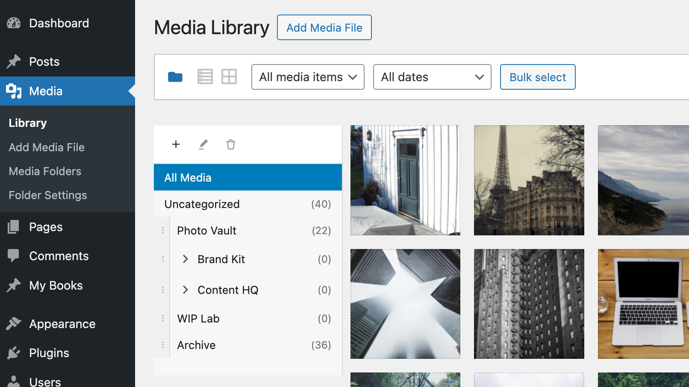

# Virtual Media Folders

Virtual folder organization and smart management for the WordPress Media Library.

<a href="https://playground.wordpress.net/?blueprint-url=https://raw.githubusercontent.com/soderlind/virtual-media-folders/refs/heads/main/assets/blueprint.json"></a>

>Way back in 2006 (almost 20 years ago!), I released [ImageManager 2.0](assets/imagemnager-2006.md), a popular WordPress plugin for image management and editing. Virtual Media Folders is my modern take on media organization for WordPress, built with React and modern tooling.

## Description

Virtual Media Folders brings virtual folder organization to your WordPress Media Library. Organize your media files into hierarchical folders without moving files on disk—folders are virtual, so your URLs never change.

<a href="https://www.youtube.com/watch?v=bA4lf7ynz24"></a>

### Features

- **Virtual Folders**: Create hierarchical folder structures to organize media
- **Drag & Drop**: Easily move media between folders with drag and drop
- **Sticky Sidebar**: Folder navigation stays visible while scrolling through media
- **Gutenberg Integration**: Filter media by folder directly in the block editor
- **Bulk Actions**: Move multiple media items at once
- **Keyboard Accessible**: Full keyboard navigation support
- **Internationalized**: Ready for translation (Norwegian Bokmål included)

## Requirements

- WordPress 6.8 or higher
- PHP 8.3 or higher

## Installation

- Download [`virtual-media-folders.zip`](https://github.com/soderlind/virtual-media-folders/releases/latest/download/virtual-media-folders.zip)
- Upload via  Plugins > Add New > Upload Plugin
- Activate the plugin.

Plugin [updates are handled automatically](https://github.com/soderlind/wordpress-plugin-github-updater#readme) via GitHub. No need to manually download and install updates.

### Development

```bash
# Add via Composer
composer require soderlind/virtual-media-folders

# Install dependencies
composer install
npm install

# Start development build with watch
npm run start

# Build for production
npm run build

# Run PHP tests
composer test

# Run JavaScript tests
npm test
```

## Usage

### Organizing Media

1. Go to **Media > Library** in your WordPress admin
2. Click the folder icon next to the view switcher to show the folder sidebar
3. Use the **+** button to create new folders
4. Drag and drop media items onto folders to organize them
5. Click a folder to filter the media library view

### Gutenberg Block Editor

When inserting media in the block editor:

1. Open the Media Library modal from a block (e.g., Image or Gallery block etc.)
2. Use the folder sidebar to filter by folder
3. Select your media as usual

## Folder Structure

```
virtual-media-folders/
├── build/              # Compiled assets
├── docs/               # Documentation
├── languages/          # Translation files
├── src/
│   ├── Admin.php       # Media Library integration
│   ├── Editor.php      # Gutenberg integration  
│   ├── RestApi.php     # REST API endpoints
│   ├── Settings.php    # Settings page
│   ├── Suggestions.php # Smart suggestions
│   ├── Taxonomy.php    # Custom taxonomy
│   ├── admin/          # Media Library UI
│   │   ├── components/ # React components
│   │   └── styles/     # CSS
│   ├── editor/         # Gutenberg integration
│   └── shared/         # Shared components & hooks
├── tests/
│   ├── js/             # Vitest tests
│   └── php/            # PHPUnit tests
├── uninstall.php       # Cleanup on uninstall
└── virtual-media-folders.php    # Main plugin file
```

## REST API

The plugin provides REST API endpoints under `vmf/v1`:

### Folders

- `GET /folders` - List all folders
- `POST /folders` - Create a folder
- `GET /folders/{id}` - Get a folder
- `PUT /folders/{id}` - Update a folder
- `DELETE /folders/{id}` - Delete a folder
- `POST /folders/{id}/media` - Add media to folder
- `DELETE /folders/{id}/media` - Remove media from folder

## Hooks & Filters

### Actions

- `vmf_folder_created` - Fired when a folder is created
- `vmf_folder_deleted` - Fired when a folder is deleted
- `vmf_media_moved` - Fired when media is moved to a folder

### Settings Filters

#### `vmf_default_settings`

Filter the default settings values.

```php
add_filter( 'vmf_default_settings', function( $defaults ) {
    // Change default values
    $defaults['show_all_media']            = true;
    $defaults['show_uncategorized']        = true;
    $defaults['jump_to_folder_after_move'] = false;
    $defaults['default_folder']            = 0;
    return $defaults;
} );
```

#### `vmf_settings`

Filter all settings at once after loading from the database.

```php
add_filter( 'vmf_settings', function( $options ) {
    // Force jump to folder after move for all users
    $options['jump_to_folder_after_move'] = true;
    return $options;
} );
```

#### `vmf_setting_{$key}`

Filter a specific setting value. Available keys:
- `show_all_media` - Show "All Media" in sidebar
- `show_uncategorized` - Show "Uncategorized" in sidebar  
- `jump_to_folder_after_move` - Navigate to folder after moving files
- `default_folder` - Default folder for new uploads (0 = none)

```php
// Hide "All Media" option for non-administrators
add_filter( 'vmf_setting_show_all_media', function( $value, $key, $options ) {
    if ( ! current_user_can( 'manage_options' ) ) {
        return false;
    }
    return $value;
}, 10, 3 );

// Always show uncategorized for editors
add_filter( 'vmf_setting_show_uncategorized', function( $value ) {
    if ( current_user_can( 'edit_others_posts' ) ) {
        return true;
    }
    return $value;
} );
```

> **Note:** At least one of `show_all_media` or `show_uncategorized` must be `true`. If both are set to `false` via filters, `show_all_media` will automatically be set to `true`.

### Preconfiguring Folders

You can programmatically create folders using the WordPress taxonomy API. Use the `after_setup_theme` or `init` hook with a one-time check to avoid creating duplicates:

```php
add_action( 'init', function() {
    // Only run once - use an option flag
    if ( get_option( 'my_theme_vmf_folders_created' ) ) {
        return;
    }

    // Make sure the taxonomy exists
    if ( ! taxonomy_exists( 'media_folder' ) ) {
        return;
    }

    // Define your folder structure
    $folders = [
        'Photos' => [
            'Events',
            'Products',
            'Team',
        ],
        'Documents' => [
            'Reports',
            'Presentations',
        ],
        'Videos',
        'Logos',
    ];

    // Create folders
    foreach ( $folders as $parent => $children ) {
        if ( is_array( $children ) ) {
            // Parent folder with children
            $parent_term = wp_insert_term( $parent, 'media_folder' );
            if ( ! is_wp_error( $parent_term ) ) {
                foreach ( $children as $child ) {
                    wp_insert_term( $child, 'media_folder', [
                        'parent' => $parent_term['term_id'],
                    ] );
                }
            }
        } else {
            // Top-level folder (no children)
            wp_insert_term( $children, 'media_folder' );
        }
    }

    // Mark as done so it only runs once
    update_option( 'my_theme_vmf_folders_created', true );
}, 20 ); // Priority 20 to run after taxonomy registration
```

You can also set the custom folder order using term meta:

```php
// Set custom order for folders (lower numbers appear first)
update_term_meta( $term_id, 'vmf_order', 0 ); // First position
update_term_meta( $term_id, 'vmf_order', 1 ); // Second position
```

### Other Filters

- `vmf_suggestion_matchers` - Customize suggestion matching logic
- `vmf_folder_capabilities` - Modify capability requirements

## Translation

Generate translation files:

```bash
# Generate POT file
npm run i18n:make-pot

# Generate JSON files for JavaScript
npm run i18n:make-json

# Generate PHP files for faster loading
npm run i18n:make-php
```

## Contributing

Contributions are welcome! Please:

1. Fork the repository
2. Create a feature branch
3. Write tests for new functionality
4. Ensure all tests pass
5. Submit a pull request

# Copyright and License

Virtual Media Folders is copyright 2025 Per Soderlind

Virtual Media Folders is free software: you can redistribute it and/or modify it under the terms of the GNU General Public License as published by the Free Software Foundation, either version 2 of the License, or (at your option) any later version.

Virtual Media Folders is distributed in the hope that it will be useful, but WITHOUT ANY WARRANTY; without even the implied warranty of MERCHANTABILITY or FITNESS FOR A PARTICULAR PURPOSE. See the GNU General Public License for more details.

You should have received a copy of the GNU Lesser General Public License along with the Extension. If not, see http://www.gnu.org/licenses/.

